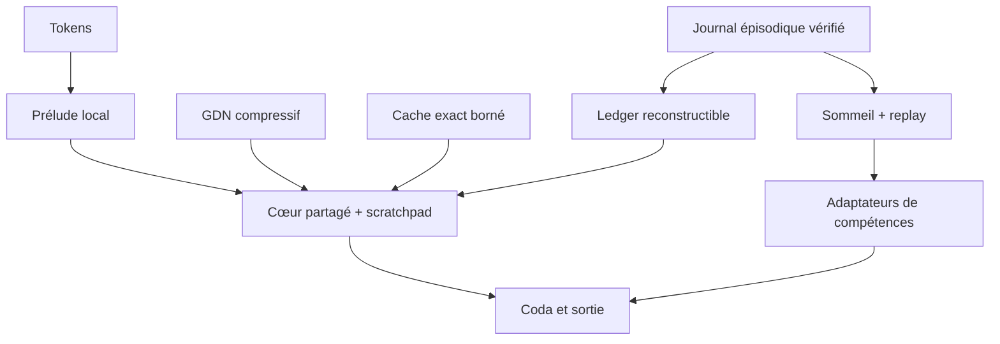

# 08 — Prophet Continuum v0.3

**Statut :** hypothèse d'architecture falsifiable, pas architecture validée
**Date :** 2026-09-04
**Cible :** un A100 80 Go pour l'entraînement ; RTX 5090, Mac Studio et variante
iPhone pour l'inférence

## Verdict

Il n'existe pas un module unique qui résout simultanément contexte long, rappel exact,
raisonnement adaptatif et apprentissage continu. Ces fonctions demandent des supports aux
propriétés incompatibles. Prophet v0.3 doit donc les **séparer par durée de vie** et ne
promouvoir une information vers un support plus risqué que lorsqu'un test tenu à l'écart
prouve un transfert.

La proposition est **Prophet Continuum** :

1. une cellule de contexte tri-mémoire — récurrence compressive, petite fenêtre exacte et
   cache exact borné par surprise ;
2. un cœur à profondeur récurrente muni d'un petit bloc-notes latent éphémère ;
3. un arrêt calibré après l'entraînement des trajectoires, jamais utilisé pour créer les
   trajectoires de base ;
4. un journal épisodique vérifiable dont le product-key ledger n'est qu'un index
   reconstructible ;
5. une petite banque bornée d'adaptateurs pour les **compétences**, extérieure au cœur
   partagé ;
6. une phase de sommeil réversible, avec replay, dont tout delta est rejeté s'il échoue à
   une seule porte de rétention, transfert ou sécurité.

Ce qui est nouveau ici est la combinaison et son protocole de promotion — notamment
l'admission d'un cache exact par la norme de l'édition récurrente et le critère quantifié
mémoire-versus-compétence. Aucun résultat n'autorise encore à l'appeler une solution.



## 1. Les bornes qu'il ne faut plus promettre de franchir

### 1.1 Contexte exact illimité et mémoire strictement bornée sont incompatibles

Une récurrence à précision finie doit augmenter son nombre de bits avec la longueur pour
résoudre le rappel associatif multi-requêtes général. Les SSM ont une limite apparentée
sur la copie. Une mémoire active bornée peut avoir une **excellente dégradation**, pas une
garantie de rappel exact illimité ([BASED](https://arxiv.org/abs/2402.18668),
[Repeat After Me](https://arxiv.org/abs/2402.01032)).

Conséquence : Prophet offre deux contrats distincts.

- **Mode mobile borné :** état actif constant, avec éviction mesurée et rappel non garanti.
- **Mode archive :** récupération de blocs originaux par landmarks/index externe ; l'état
  actif reste borné mais l'archive totale croît. Il faut l'annoncer comme telle.

### 1.2 Un nombre fixe de poids ne peut apprendre un flux illimité sans compromis

Un système fini doit finir par grandir, oublier, compresser ou externaliser. Le but
réaliste n'est donc pas « zéro oubli pour toujours », mais :

- faits et exceptions dans une mémoire épisodique corrigeable ;
- régularités récurrentes dans une capacité de compétence bornée et versionnée ;
- oubli explicite, mesuré et réversible plutôt que dérive invisible du tronc.

### 1.3 Profondeur latente et bloc-notes sont deux ressources différentes

Boucler un bloc augmente le calcul sériel mais ne crée pas un tampon adressable. Sur une
tâche Sudoku synthétique, des tokens mémoire sont nécessaires et un plateau apparaît entre
8 et 32 slots, avec dilution à 64 ; c'est une bonne hypothèse d'ablation, pas une preuve à
l'échelle LM ([Universal Transformers Need Memory](https://arxiv.org/abs/2604.21999)).

Enfin, sortir tôt sous un plafond `Kmax` constant est du **calcul adaptatif borné**. Cela
ne change pas une classe de complexité, même si la latence moyenne diminue.

## 2. Architecture proposée

### 2.1 Cellule de contexte tri-mémoire

Chaque point d'insertion combine trois chemins, puis apprend leur fusion par portes :

| Chemin | Rôle | Coût d'état | Échec accepté |
|---|---|---:|---|
| GDN/GDN2 | résumé compressif du flux lointain | constant | collisions, oubli graduel |
| SWA 128–256 | ordre, syntaxe et copie récente exacts | fenêtre bornée | passé ancien invisible |
| cache exact 64 slots | associations lointaines jugées importantes | capacité bornée | éviction au-delà de 64 |

[Gated DeltaNet](https://arxiv.org/abs/2412.06464) apporte oubli et réécriture sélectifs.
[Gated DeltaNet-2](https://arxiv.org/abs/2605.22791) découple décroissance, effacement et
écriture ; il devient le candidat v0.3 face au GDN actuel, pas un remplacement acquis. Son
code officiel est sous une licence NVIDIA non commerciale : l'équation peut guider une
réimplémentation propre, mais le code ne doit pas être copié sans revue de licence.

Le cache exact conserve les 64 couples clé/valeur ayant les éditions les plus importantes.
L'hypothèse à tester adapte le signal de [HOLA](https://arxiv.org/abs/2607.02303) :

\[
m_t = \left\|S_t - \operatorname{Diag}(\alpha_t)S_{t-1}\right\|_F.
\]

Ce score mesure ce que la cellule a réellement dû modifier, mais rareté n'est pas utilité.
Les ablations doivent donc le comparer à récence, surprise NLL tronquée, diversité et un
oracle top-64. Une clé nulle et un seuil calibré doivent permettre « aucun souvenir
pertinent » ; un softmax top-k forcé injecte sinon une correction arbitraire.

À `d=1024`, 16 têtes et `d_k=d_v=64`, une matrice GDN par profondeur virtuelle contient
`16×64×64 = 65 536` valeurs, soit 128 Kio en BF16. Douze profondeurs demandent 1,5 Mio.
Un cache de 64 clés+valeurs de largeur 1024 demande 256 Kio par profondeur, soit 3 Mio ;
avec quelques caches SWA-GQA et les métadonnées, la cible d'état dynamique est **<8 Mio**.

### 2.2 Scratchpad latent éphémère

Ajouter `M∈{0,4,8,16,32,64}` slots faibles-rangs, remis à zéro à chaque exemple ou session.
Ils servent uniquement au calcul récurrent : ils ne contiennent ni faits persistants ni
données d'un autre utilisateur. Une cross-attention `O(nM)` les met à jour et les réinjecte
dans le cœur/coda.

Le candidat initial est `M=8` ou `16`. Il n'est retenu que si son gain survit à une
comparaison iso-FLOPs et à des instances hors distribution. Un gain dû seulement à des
opérations supplémentaires n'est pas un gain architectural.

### 2.3 Profondeur : entraîner la trajectoire, calibrer l'arrêt ensuite

[Huginn](https://arxiv.org/abs/2502.05171) valide à grande échelle le patron
prélude/cœur partagé/coda, la réinjection de l'entrée, l'échantillonnage de profondeur et
la rétropropagation tronquée. Mais son échelle (3,5B, environ 800B tokens) dépasse de très
loin Prophet, et le CoT explicite garde un avantage en mathématiques.

Le protocole v0.3 est donc en deux phases.

1. **Backbone :** superviser les sorties à `k={1,2,4,8}`, avec une queue occasionnelle à
   16 et des poids fixes. Conserver une CE pleine à la dernière profondeur. Tester une KL
   `stop-gradient` profond→peu profond sans réduire la qualité profonde.
2. **Arrêt :** geler le backbone, puis comparer marge top-1 et KL entre deux sorties
   successives à un petit MLP. Exiger deux décisions stables consécutives. Garder le MLP
   seulement s'il Pareto-domine les heuristiques sur validation et OOD.

Cette séparation suit le résultat récent selon lequel la supervision pondérée par un gate
peut dégrader les trajectoires elles-mêmes, tandis que des sorties multi-profondeur fixes
plus une règle post-hoc font aussi bien ou mieux
([Adaptive Depth in Looped Transformers](https://arxiv.org/abs/2607.20519)).

Le signal d'arrêt est calculé par requête en v0.3, mais l'implémentation actuelle garde
une profondeur commune au batch et attend que toutes les requêtes franchissent le seuil.
Obtenir une économie réellement individuelle demande un ordonnanceur qui compacte le
batch. De plus, `halt_threshold` est volontairement refusé avec un cache incrémental : une
profondeur qui remonte laisserait des tokens absents des états récurrents profonds, et les
sondes coda sans écriture ne voient pas l'historique exact du coda. Backfill, recalcul ou
profondeur monotone doivent d'abord rétablir l'équivalence causale. Ce sont des bloqueurs
de mesure de latence, pas encore un résultat. Le routage par token de
[Mixture-of-Recursions](https://arxiv.org/abs/2507.10524) n'est pas directement
transposable à un GDN causal : sauter un token change l'état séquentiel. Il reste une
ablation v0.4.

### 2.4 Mémoire durable : journal d'abord, ledger ensuite

Le product-key ledger ne doit pas être la source de vérité. Il doit être une vue
matérialisée reconstruite depuis un journal append-only. Chaque événement porte au
minimum :

| Champ | Pourquoi il est obligatoire |
|---|---|
| `memory_id`, `scope` | isolation utilisateur/session |
| hash du contenu et source | audit et déduplication |
| modèle/encodeur/version d'index | reproductibilité de l'adressage |
| vérificateur, résultat, confiance | écriture fail-closed |
| date, TTL, statut | expiration explicite |
| `supersedes` / tombstone | correction et droit à l'oubli |

Le contrat d'injection doit être unique, par exemple après la normalisation finale :

```text
z = norm_out(x)
(delta, confidence, ids) = memory.read(z)
z' = z + clip(gate(confidence) * delta)
logits = lm_head(z')
```

La consolidation doit apprendre et être évaluée dans **ce même espace**. La version
actuelle entraîne un ledger externe sur `model.hidden` puis teste une addition manuelle,
alors que le modèle intégré lit ses ledgers à l'intérieur du trunk/coda. Cela démontre un
wrapper expérimental, pas le chemin de production.

### 2.5 Faits dans le ledger, compétences dans des adaptateurs bornés

Les résultats 89/71/11 de
[Sparse Memory Finetuning](https://arxiv.org/abs/2510.15103) concernent des rangées
sélectionnées par activation nouvelle-versus-background dans une couche mémoire
préentraînée, ajustées par gradient. Le ledger Prophet actuel utilise des clés aléatoires
gelées et une écriture de valeurs en forme close. Le chiffre 11 % est donc une motivation
pour comparer des supports creux, **pas un résultat de Prophet**.

Pour les compétences répétées, v0.3 teste une banque bornée de 4–8 adaptateurs routés une
fois par requête, autour du prélude/coda ou des projections externes — jamais à l'intérieur
du poids partagé du cœur, où une perturbation est réappliquée `k` fois. Les faits et
exceptions restent dans le journal/ledger.

[WISE](https://arxiv.org/abs/2405.14768) motive la séparation tronc stable/mémoire
latérale ; [SuRe](https://arxiv.org/abs/2511.22367) motive un replay par surprise et une
consolidation rapide/lente. Surprise brute sélectionne aussi bruit et poison : la priorité
proposée est surprise **modérée** × confiance/provenance × diversité, avec exclusion des
extrêmes.

### 2.6 Sommeil : synthétiser, vérifier, proposer, puis éventuellement rejeter

Une phase hors ligne peut produire paraphrases, questions, implications et
contre-exemples, puis vérifier ces variations avant de les écrire. C'est la version
prudente de [SEAL](https://arxiv.org/abs/2506.10943) et du continuum de fréquences de
[Nested Learning/HOPE](https://arxiv.org/abs/2512.24695). Elle ne donne jamais au modèle
le droit d'auto-écrire directement son tronc.

Le replay commence par la baseline simple rewarm/redecay + 5 % pour un faible changement
de distribution, puis balaie 1/5/25 %. Chaque comparaison fixe l'acquisition de nouvelles
connaissances ; une LoRA qui « oublie moins » parce qu'elle apprend moins n'est pas un
succès.

## 3. La mesure qui distingue cache et apprentissage

Soient `S` les épisodes écrits et `H` des membres disjoints de la même famille, avec
contexte et état de session effacés :

\[
g_{rappel}=BPB(S,off)-BPB(S,on),\qquad
g_{transfert}=BPB(H,off)-BPB(H,on),
\]

\[
\sigma = \frac{g_{transfert}}{g_{rappel}}.
\]

- `σ≈0` : cache d'instances ;
- `σ>0` : début de transfert ;
- `σ<0` : la mémoire nuit aux voisins ;
- `σ>1` : résultat possible, mais à auditer pour fuite ou mismatch de difficulté.

`prophet.eval.continual.SkillMeasurement` implémente cette mesure sans tronquer les cas
négatifs et refuse de former un ratio lorsque `g_rappel≤10⁻⁶`, où le quotient serait
numériquement trompeur. `evaluate_consolidation()` formalise une décision qui n'est
positive que si **toutes** les conditions suivantes passent :

| Porte | Seuil initial |
|---|---:|
| coût général | `ΔBPB ≤ +0,005` |
| acquisition mesurable | `g_rappel avant/après ≥ 0,01 BPB` |
| acquisition conservée | `g_rappel après / avant ≥ 0,95` |
| transfert absolu | `σ_après ≥ 0,05` |
| progrès de transfert | `Δσ ≥ +0,10` |
| intégrité du ledger | `Δrecall_error ≤ +0,05` |
| stabilité d'adressage | Jaccard `≥0,80` |
| injection hostile | aucune hausse |

L'API retourne toutes les causes de refus et `require_acceptance()` permet à l'appelant de
lever avant mutation. Elle n'est pas encore câblée au merge : V03-E0 doit imposer cet appel
dans l'unique chemin de fusion et supprimer tout delta refusé. Dans le système cible, le
journal épisodique reste intact ; un refus est un résultat normal, pas une erreur
d'exécution.

## 4. Expériences décisives sous le budget réel

Le plan actuel alloue déjà 270 des 300 heures-A100 disponibles et garde 30 heures de
réserve. La campagne v0.3 ne peut pas être ajoutée aux productions existantes. Elle doit
d'abord réutiliser les budgets de gates R02/R03/R04 ; une campagne complète d'environ 235
heures **remplacerait** les productions qu'elle invalide.

| Gate | Expérience | Budget | GO |
|---|---|---:|---|
| V03-E0 | imports propres, causalité, reprise, index mémoire, no-match, rollback | CPU | zéro invariant silencieux |
| V03-E1 | GDN actuel vs GDN2 propre ; SWA seule ; tri-mémoire à octets égaux | 6 h | rappel 16–32K ×2, ΔPPL ≤0,3, latence <15 %, état <8 Mio |
| V03-E2 | `M={0,4,8,16,32,64}` × `k={1,2,4,8,16}` sur planning/MQAR/state tracking | 8 h | nouveau point Pareto iso-FLOPs, gain OOD, ≥2/3 seeds |
| V03-E3 | ledger actuel vs SMF-like vs RAG, acquisition égale ; `σ`, BWT, corrections | 3 h | transfert inédit et meilleur Pareto acquisition/oubli |
| V03-E4 | fixed-k, oracle, marge/KL, MLP gelé, ponder conjoint | 1 h | ≤1 point perdu et ≥20 % FLOPs ou ≥15 % latence réelle |
| V03-E5 | contradictions, 1 % poison, TTL/tombstone/rebuild | 0,5 h | injection 0 %, correction et suppression exactes |

Total gate-first : **18,5 heures-A100**, plus tests CPU. Aucun composant n'entre dans le
profil principal avant ce verdict.

Les contrôles obligatoires sont :

- Transformer/GDN non partagé iso-paramètres et baseline dense iso-FLOPs ;
- courbes qualité–FLOPs **et** qualité–millisecondes, moyenne et p95 ;
- difficulté procédurale connue et OOD, au moins trois seeds pour le verdict ;
- RULER, BABILong, NoLiMa, MQAR, contradictions temporelles et contamination après reset ;
- recurrence seule, CoT court, CoT complet et recurrence+CoT court à FLOPs égalisés ;
- mesure après 1/10/100/1000 écritures, prompts et caches entièrement effacés.

## 5. État vérifié du dépôt au début de v0.3

L'outil de budget rapporte **275,67M paramètres**, et non 500M, pour
`configs/prophet_500m_probe.json`, avec 28,76B tokens abordables sous ses hypothèses de
300 heures et 35 % MFU. Les calculs ou documents qui le traitent comme un vrai 500M doivent
être corrigés avant une comparaison de scaling.

Le commit de départ contient également des prototypes qui ne sont pas encore des preuves :

- la halte pondérait `mean(p) × mean(CE)` au lieu de `mean(p × CE)` ;
- la décision d'arrêt moyennait batch et séquence ;
- les candidats de halte contournaient `norm_out` ;
- `loop_k` rapportait le plafond demandé, pas le nombre exécuté ;
- les indices de `memory.layers` étaient globaux dans la configuration mais locaux dans le
  forward récurrent ;
- `verified=True` rendait la consolidation fail-open ;
- les tests de profondeur mesurent surtout la mémorisation d'états aléatoires et tolèrent
  l'absence de gain end-to-end ;
- aucune abstention de lecture, provenance, suppression ciblée ou reconstruction du ledger
  n'existe encore ;
- la halte adaptative est désactivée avec cache tant que l'historique de chaque profondeur
  ne peut pas être garanti ;
- le package suivi par git ne contient pas `prophet/data`, bien que l'entraînement et les
  tests l'importent, et aucun workflow CI ne protège un clone propre.

Dans la branche v0.3, les six premiers défauts sont corrigés, `prophet/data` est de nouveau
suivi, un CI de clone propre est ajouté, et la métrique `σ` avec porte de fusion est
exécutable. Les tests de profondeur sans gain end-to-end, la halte adaptative sans
ordonnanceur causal, et l'absence d'abstention, provenance, suppression ciblée et
reconstruction du ledger restent des bloqueurs explicites de V03-E0.

## 6. Critère de mort de l'architecture

Prophet Continuum v0.3 est rejeté — pas renommé — si l'un des résultats suivants tient :

1. la tri-mémoire ne bat pas une fenêtre de récence agrandie au même nombre d'octets ;
2. le scratchpad ne crée aucun nouveau point Pareto iso-FLOPs ou perd son gain OOD ;
3. la profondeur partagée perd contre une profondeur non partagée iso-compute au-dessus
   de 350M paramètres ;
4. marge/KL égale le gate appris, auquel cas le gate est supprimé ;
5. `σ` reste proche de zéro, auquel cas le ledger est documenté comme cache ;
6. après 20 cycles, l'épisodique seul bat la consolidation ; la consolidation est alors
   désactivée par défaut ;
7. correction, oubli ciblé, isolation utilisateur ou refus d'une lecture hors distribution
   ne peuvent pas être démontrés.

La vraie contribution recherchée n'est pas un diagramme plus complexe. C'est un système
qui **sait quel état il compresse, quel fait il conserve exactement, quelle compétence il
ose promouvoir et quand il doit refuser de se modifier**.

## Sources primaires complémentaires

- [TTT — Learning to (Learn at Test Time)](https://arxiv.org/abs/2407.04620)
- [Titans — Learning to Memorize at Test Time](https://arxiv.org/abs/2501.00663)
- [ATLAS — Learning to Optimally Memorize the Context](https://arxiv.org/abs/2505.23735)
- [Infini-attention](https://arxiv.org/abs/2404.07143)
- [TransformerFAM](https://arxiv.org/abs/2404.09173)
- [Context Length Alone Hurts](https://arxiv.org/abs/2510.05381)
- [STARS — Stabilizing Recurrent Dynamics](https://arxiv.org/abs/2605.26733)
- [Coconut — Training Large Language Models to Reason in a Continuous Latent Space](https://arxiv.org/abs/2412.06769)
- [Distilling System 2 into System 1](https://arxiv.org/abs/2407.06023)
